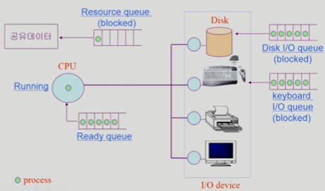

## [프로세스 #1](https://core.ewha.ac.kr/publicview/C0101020140318134023355997?vmode=f)

### 프로세스의 개념

> "Process is **a program in execution**"

- 즉 실행중인 프로그램을 말한다.

#### 프로세스의 문맥 (context)

- CPU 수행 상태를 나타내는 하드웨어 문맥

  - (어느 시점에서의 상태)
  - Program Counter
  - 각종 Register

- 프로세스의 주소 공간

  - code, data, stack

- 프로세스 관련 커널 자료 구조
  - **PCB (Process Control Block)** : 운영체제 커널의 자료 구조, 실행중인 특정한 프로세스 관리 정보를 포함
  - **Kernel stack** : Sysyem Call 상황시 Program Counter가 커널 주소 공간에서의 함수 호출이 이루어질때 쌓아지는 별도의 공간

### 프로세스의 상태 (Process State)

> 프로세스는 상태(state)가 변경되며 수행된다.

- `Running`
  - CPU를 잡고 instruction을 수행중인 상태
- `Ready`
  - CPU를 기다리는 상태(메모리 등 다른 조건을 모두 만족하고)
- `Blocked` (`wait`, `sleep`)
  - CPU를 주어도 당장 instruction을 수행할 수 없는 상태
  - 프로세스 자신이 요청한 이벤트 (ex.I/O)가 즉시 만족되지 않아 이를 기다리는 상태
  - ex. 디스크에서 file을 읽어와야 하는 경우

 

- `New` : 프로세스가 생성 중인 상태
- `Terminated` : 수행(execution)이 끝난 상태
   

##### 프로세스 상태도

### Process Control Block(PCB)

-

### 문맥 교환 (Context Switch)

-

### 프로세스를 스케줄링하기 위한 큐

-

### 스케줄러 (Scheduler)

-

## [프로세스 #2](https://core.ewha.ac.kr/publicview/C0101020140321141759959993?vmode=f)

### 질문 답변 > [1, 2장 운영체제 개요 및 컴퓨터시스템의 구조](/운영체제/1,-2장-운영체제-개요-및-컴퓨터시스템의-구조.md)

### Thread

-

## 프로세스 #3

### Single and Multithreaded Processes

-

### Benefits of Threads

-

### Implementation of Threads

-
