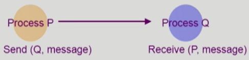
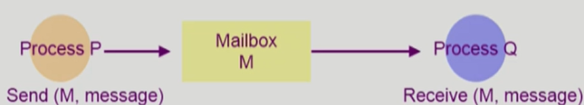
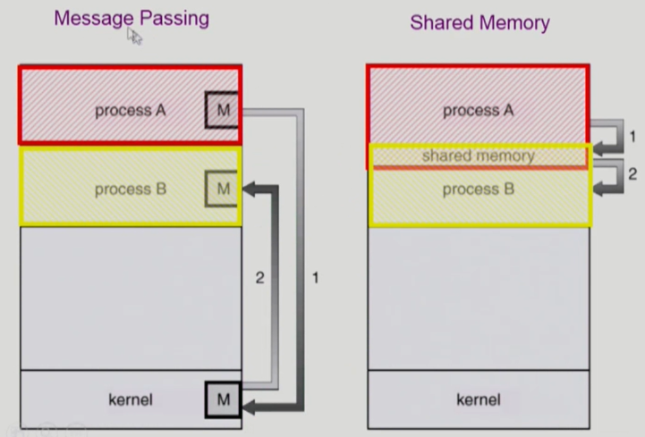

<!--
## [프로세스 관리 #1](https://core.ewha.ac.kr/publicview/C0101020140321144554159683?vmode=f)

### 프로세스 생성 (Process Creation)

-

### 프로세스 종료 (Process Termination)

-

## [프로세스 관리 #2](https://core.ewha.ac.kr/publicview/C0101020140325134428879622?vmode=f)

### 프로세스와 관련한 시스템콜

- fork()
- exec()
- wait()
- exit()

### 프로세스 간 협력

-->

### Message Passing

- Message system
  - 프로세스 사이에 공유 변수(shared variable)를 일체 사용하지 않고 메시지를 주고 받으면서 통신하는 시스템
  - 메시지 통신을 하는 시스템은 커널에 의해 send와 receive 연산을 제공받는다.
- Direct Communication (직접 통신)

  - 통신하려는 프로세스의 이름을 명시적으로 표시
  - 각 쌍의 프로세스에게는 오직 하나의 링크만 존재한다.
    

- Indirect Communication (간접 통신)
  - mailbox (또는 port)를 통해 메시지를 간접 전달
  - 각 mailbox에는 고유의 id가 있으며 이를 공유하는 프로세스만 통신할 수 있다.
  - 하나의 링크가 여러 프로세스에게 할당될 수 있다.
    

### Interprocess communication

- 공유 메모리 방식
  

      - 공유 메모리 방식은 프로세스들이 주소 공간의 일부를 공유한다.
      - 서로의 데이터에 일관성 문제가 유발될 수 있다.
      - 프로세스 간 동기화 문제를 스스로 책임져야 한다

<!--
### CPU and I/O Bursts in Program Execution

-

### CPU-burst Time의 분포

-

### 프로세스의 특성 분류

-

### CPU Scheduler & Dispatcher

-
-->
