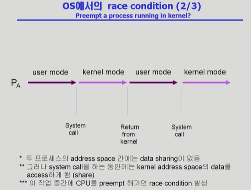

## [프로세스 동기화 #1](https://core.ewha.ac.kr/publicview/C0101020140401134252676046?vmode=f)

39분 부터 시작

### 데이터의 접근

- 데이터를 읽기만 하면 문제가 될 게 없다. 다만, 이렇게 데이터를 읽어와서 수정하고 다시 저장하는 방식에서는 누가 먼저 읽어갔느냐에 따라 달라질 수 있는 문제를 synchronize 문제 라고 한다.

### Race Condition

- 하나의 데이터에 여러 process가 쓰기 작업을 했을 때 발생

### OS에서의 Race Condition

- 언제 발생하는가?

1. kernel 수행 중 인터럽트 발생 시

- 원래는 +1, -1 으로 count 변수는 원래값과 동일해야 하는데, -1한 것은 반영이 안되고 이를 감소시키기 전에 값을 읽어놨다가 +1 하고 저장했기때문에 증가한 것만 반영이 된다.
- 커널의 코드가 쓰는 도중에 인터럽트가 발생해서 인터럽트 처리를 하게 되면 (인터럽트 핸들러 또한 커널의 코드이기 때문에) 커널에 있는 데이터를 양쪽에서 건드리는 도중에 처리를 했기 때문에 발생
- 해결: 중요한 변수 값을 건드리는 동안에 인터럽트가 들어와도 바로 그 처리 루틴으로 넘어가는 것이 아니라 이 작업이 끝날 때까지는 인터럽트 처리를 하지 않는다.

 

2. Process가 system call을 하여 kernel mode로 수행 중인데 context switch가 일어나는 경우

 

3. Multiprocessor에서 shared memory 내의 kernel data

### Process Synchronization 문제

- Example of a Race Condition
  
   

- The Critical-Section Problem
  - n개의 프로세스가 공유데이터를 동시에 사용하기를 원하는 경우
  - 각 프로세스의 code segment에는 공유 데이터를 접근하는 코드인 **critical section**이 존재
  - Problem - 하나의 프로세스가 critical section에 있을 때 다른 모든 프로세스는 critical section에 들어갈 수 없어야 한다.
  <!--

### 프로그램적 해결법의 충족조건

- Initial Attempts to Solve Problem

## [프로세스 동기화 #2](https://core.ewha.ac.kr/publicview/C0101020140404151340260748?vmode=f)

### Semaphores

-

### Critical Section of n Processes

-

### Block / Wakeup Implementation

-

### Two Types of Semaphores

-

### Deadlock and Starvation

-

## [프로세스 동기화 #3](https://core.ewha.ac.kr/publicview/C0101020140408134626290222?vmode=f)

## [프로세스 동기화 #4](https://core.ewha.ac.kr/publicview/C0101020140411143154161543?vmode=f)

### Classical Problems of Syncronization

- Bounded-Buffer Problem (Producer-Consumer Problem)
- Readers-Writers Problem
- Dining-Philosophers Problem

### Monitor

- -->
