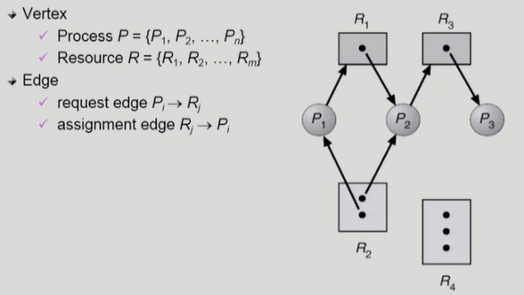
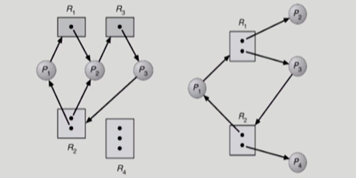

<!-- ## [교착상태 #1](https://core.ewha.ac.kr/publicview/C0101020140411151510275738?vmode=f)

## [교착상태 #2](https://core.ewha.ac.kr/publicview/C0101020140415131030840772?vmode=f)

### The Deadlock Problem

-  -->

### Deadlock 발생의 4가지 조건

- **Mutual exclusion** (상호 배제)
  - 매 순간 **하나의 프로세스만**이 자원을 사용할 수 있음
- **No preemption** (비선점)
  - 프로세스는 자원을 스스로 내어놓을 뿐 **강제로 빼앗기지 않음**
- **Hold and wait** (보유 대기)
  - 자원을 가진 프로세스가 다른 자원을 기다릴 때 **보유 자원을 놓지 않고 계속** 가지고 있음
- **Circular wait** (점유 대기)

  - 자원을 기다리는 프로세스 간에 **사이클**이 형성되어야 함
  - P0 - P1 - P2 - ... - Pn-1 - Pn - P0
     

- 네 가지 조건 중 하나라도 충족이 안되면 deadlock이 발생하지 않음

### Resource-Allocation Graph(자원할당그래프)

- 정점 : 프로세스(동그라미) 혹은 자원(사각형)
- 간선 : 자원을 요청하거나 할당한다
  - 자원 -> 프로세스 : 프로세스가 자원에 할당되어 있음
  - 프로세스 -> 자원 : 요청함

- 그래프에 사이클이 없으면 deadlock이 아님 (화살표 따라 가보기)
- 그래프에 하나라도 사이클이 있으면 deadlock일 가능성 O

  - 자원에 인스턴스가 하나밖에 없으면 deadlock임

- 오른쪽 = deadlock O , 왼쪽 = deadlock X

<!-- ### Deadlock의 처리 방법

- Deadlock Prevention
- Deadlock Avoidance
  - Resource Allocation Graph algorithm
  - Example of Banker's Algorithm
- Deadlock Detection and recovery
- Deadlock Ignorance -->
