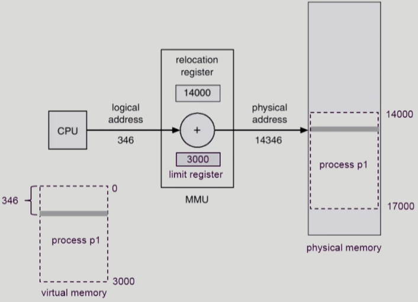
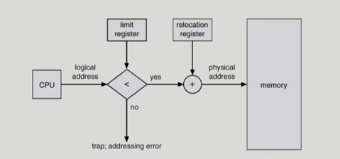

## [메모리 관리 #1](https://core.ewha.ac.kr/publicview/C0101020140425151219100144?vmode=f)

<!-- ### Logical vs. Physical Address

-

### 주소바인딩(Address Binding)

-

### Memory-Management Unit(MMU)

-  -->

### Dynamic Relocation

- CPU가 메모리 346번지(logical address)에 있는 내용을 달라고 했을 때, 주소변환이 필요하다. 이 주소 변환을 MMU의 register 2개로 하게 된다.
  - relocation register (= base register)
  - limit register
- 주소변환시, 실제 물리 메모리의 시작위치 + 논리 주소 값을 CPU에게 주면 된다.
  - 예시의 140000 + 436 = 14346
  - 이때 물리 메모리의 시작위치는 relocation register에 저장되어 있음
- limit register는 이 프로그램의 최대 크기를 담고 있다.
  - 저장해두는 이유는 악의적인 이유로 메모리 4000번지에 있는 값을 달라고 하면 줄 수가 없음.. 18000번지 주소변환이 됨.. 주면 안된다.

### Hadware Support for Address Translation

- 운영체제 및 사용자 프로세스 간의 메모리 보호를 위해 사용하는 레지스터

  - **Relocation register(=base register)** : 접근할 수 있는 물리적 메모리 주소의 최소값
  - **Limit register** : 논리적 주소의 범위
     

- limit register를 넘는 크기 메모리 주소의 값을 달라고 하는 걸 막기 위해서..
  - 프로그램 크기보다 큰 것을 요구하는지 먼저 체크 (logical address와 limit register를 비교)
  - 만약에 벗어나는 요청이면 trap(인터럽트)가 걸려서 CPU제어권이 운영체제로 넘어간다.
    - 이때 운영체제는 trap이 왜 걸렸는지 따져보고, 다른 프로그램 메모리를 요청했다는 것이 걸리면 강제종료하는 식의 대응
  - 벗어나는 요청이 아니라면, relocation register의 값을 더해서 물리주소로 변환
  - user program은 logical address만 다루기 때문에 실제 물리 주소를 알 필요가 없다.

<!--
### Some Treminologies

- Dynamic Loading
- Dynamic Linking
- Overlays
- Swapping

## [메모리 관리 #2](https://core.ewha.ac.kr/publicview/C0101020140429132440045277?vmode=f)

## [메모리 관리 #3](https://core.ewha.ac.kr/publicview/C0101020140502151452123728?vmode=f)

[Paging](/운영체제/8장-메모리-관리/Paging.md)

## [메모리 관리 #4](https://core.ewha.ac.kr/publicview/C0101020140509142939477563?vmode=f)

[Segmentation](/운영체제/8장-메모리-관리/Segmentation.md)

### Allocation of Physical Memory

- Contiguous allocation
- NonContiguous allocation
  - [Paging](/운영체제/8장-메모리-관리/Paging.md)
  - [Segmentation](/운영체제/8장-메모리-관리/Segmentation.md)
  - Paged Segmentation -->
