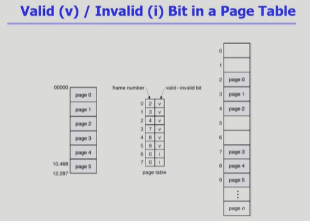

<!-- ### Paging Example

-

### Address Translation Architecture

-

### Implementation of Page Table

-

### Paging Hardware with TLB

-

### Two-Level Page Table

- Address-Translation Scheme
- Two-Level Paging Example -->

- 페이지 테이블을 다단계로 사용할 수 있다.
  - 테이블에 대한 공간을 더 줄일 수 있지만, 주소 변환을 위해 메모리에 접근하는 횟수가 많아짐
  - n단계 페이지 테이블 -> 주소변환 메모리 접근 n번 + 실제 메모리 접근 1번 = 총 n+1번

### Multilevel Paging and Performance

- address space가 더 커지면 다단계 페이지 테이블 필요!!
- 각 단계의 페이지 테이블이 메모리에 존재하기 때문에 logical address의 physical address 변환에 더 많은 메모리 접근 필요
- TLB를 통해 메모리 접근 시간을 줄일 수 있음
- 4단계 페이지 테이블을 사용하는 경우..
  - 메모리 접근 시간 100ns, TLB 접근 시간 20ns
  - TLB hit ratio : 98% 인경우
    effective memory access time = 0.98 _ (20 + 100) + 0.02 _ (20 + 100\*4 [4단계 페이지 테이블] + 100) = 128ns
  - 메모리 접근하는데 100ns걸리니까 결과적으로는.. 주소변환을 위해 128-100 = 28ns만 소요
- **결론**: 대부분이 TLB를 통해 변환되기 때문에 4단계 페이지 테이블을 써도 지나치게 오래걸리진 않음!!

### Valid (v)/ Invalid (i) Bit in a Page Table

- 위 사진은 페이지 테이블을 통해 주소변환을 하는 모습
- 페이지 테이블에는 frame number 뿐 아니라 **valid-invalid bit**도 함께 저장
  - v : valid, i : invalid
- 왼쪽에서의 페이지가 6번부터는 없지만 페이지 테이블 엔트리에는 6,7이 있다.
  - 사용하는 페이지 개수는 정해져 있지만 32bit 주소체계를 사용한다면 1M개의 페이지가 존재할 수 있기 때문에 페이지 테이블에는 그 모든 것을 표시할 수 있어야 한다. (맥시멈 사이즈만큼)
  - -> 사용하지 않더라도!! 구조상 배열이기 때문에 인덱스로 순차적 접근이 가능해야 함
    - 이때 사용하지 않는건 invalid로 표시
    - 또 해당 페이지가 물리 메모리에 올라와있지않고 swap area (백킹 스토어)에 있는 경우에도 invalid로 표시

<!-- ### Memory Protection

-

### Inverted Page Table

- Inverted Page Table Architecture

### Shared Page

- Shared Pages Example -->
